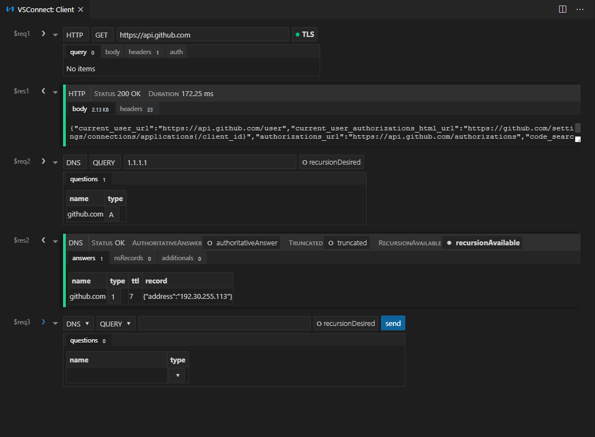

# VSConnect

*Status: Alpha (usable)*

VSConnect `("OSS - Connect")` is the ultimate network client for VS Code. It provides an interface
similar to a command line where you can submit network requests and receive network responses. It
comes with basic industry-standard Protocols such as HTTP and DNS, and it also provides several
extension points so you can add extra Protocols and UI Handlers via separate VSCode extensions.

## Contribute
Contributions, PRs and issues welcome! For new protocols and UI handlers, you can either contribute
them directly to this repo, or create a separate extension and use the commands provided to add them
to the VSConnect UI *(TODO - not available yet)*.

## Disclaimer
VSConnect is not affiliated with Visual Studio or Microsoft.

## LICENSE
The code and other assets in this repo are licensed under the MIT license, except for the VSConnect
logo and name.
